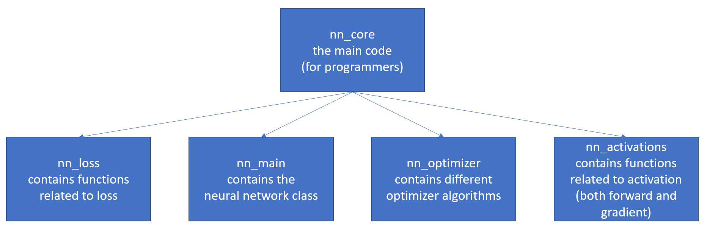
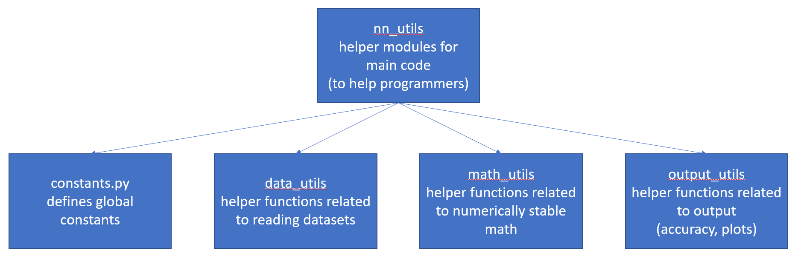
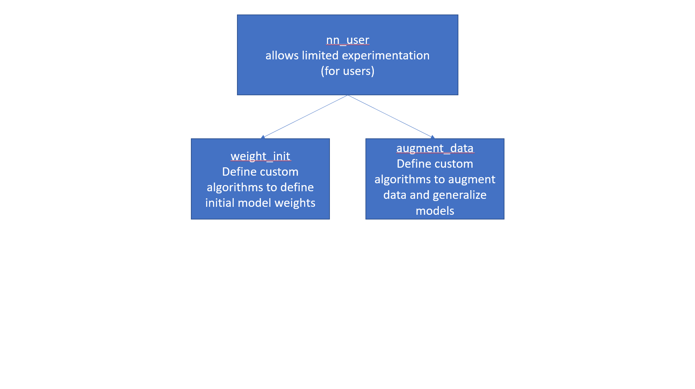

## **Guiding principles**
Ease of understanding, modularity, and ease of expanding code where three important guiding principles when I wrote the code.
As modularity is common to all three, let us understand how the neural network code is structured.

 

#### **Main structure of code**

 
 
 
 
 

#### **Structure and functionality of nn_core**

How does the nn_core code work:
- nn_loss = Add a new loss function for a specific loss in the get_loss function.
- nn_main = This defines the neural network class and will not require any edits. If required, each function's task is defined as a comment - understand and append.
- nn_optimizer = Each class is made up of an __init__ function sets up user passed variables. The setup function sets up other class variables required. The grad_update function accumulated gradients when passing through each example. The step_update function defined how the weight update has to be performed. The step_reset function resets any class variables that has to be reset after a step_update.
- nn_activations = The forward_activation function transforms pre_activation values (a(i)) of a layer to the activated values(h(i)). The grad_activation defines the derivative of h(i) wrt a(i). The grad_wrt_output defines the derivative of loss wrt to a(last_layer). 

 

#### **Structure and functionality of nn_utils**

How does the nn_utils code work:
- constants = Add a new constant by updating the __init__function.
- data_utils = This defines how the data is loaded and will not require any change for the MNIST and FashionMNIST datasets. If required, each function's task is defined as a comment - understand and append.
- math_utils = Add any specially defined mathematical utility functions here.
- output_utils = Add any functions which work on outputs - accuracy, confusion matrix, etc.

 

#### **Structure and functionality of nn_users**

How does the nn_users code work:

This should include any functionality which can be edited by the user.
- augment_data = Add a new data transformation to the list parameter of the A.compose function. You can have a look at how a particular transformation will affect your data [here](https://demo.albumentations.ai/).
- weight_init = Add a new weight initialization function which takes in three inputs - Shape of axis 0 of input, Shape of axis 1 of input and worb which can either be "w" for weights init and "b" for bias init.

 

## Software development guidelines to be followed
1. Maintaining a virtual environment is of high importance to enable easy development and deployment.
Pipenv is used as it can resolve dependencies in the virtual environment.

2. Windows and Linux compatability must be ensured as most users operate with a Windows system and most developers operate on Linux.

3. Detailed separate documentation should be provided in the form of README's. Comments should be minimized as developers are prone to change code but not edit previously written comments.

4. Modularity and functional programming is of utmost importance - one function should perform one task.

5. OOPS concepts can be followed for easy usage and modular implementation. 

6. "Premature optimization is the root of all evil" - Donald. E. Knuth - Do not plan in advance for something you are building today.
For example, in our code neural network structure is defined as a simple dictionary and not using OOPS concepts (the famous nn.add_layer() implementations). Pytorch and other libraries use them as they provide vast functionality. That is not an objective of our code.

7. The code should be developed such that it allows easy usage across collabarators. I worked on this code from two separate github profiles and from two separate workstations to keep this perspective in mind.

8. Different branches should be present when multiple different collabarators are present and the main branch should be protected. I have not followed this till now as a single user was working on the code.

9. Regular commits with easy to understand commit messages is a must. While regular commits were made and reasonably easy to read commit messages are present, a better standard could be followed.

10. Since development is in Python, the code should be implemented in the Pythonic Standard following Python best practices. For example, the naming conventions should have underscores (No camelcase).
