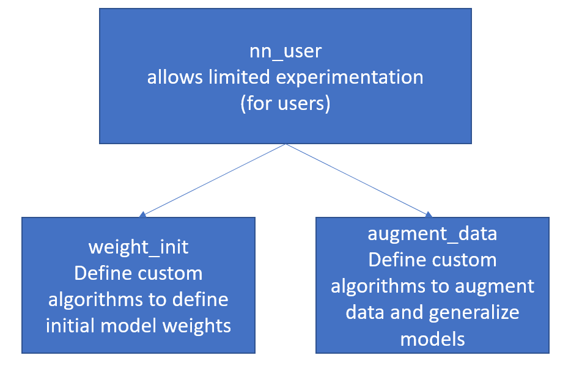

## Guiding principles : 
Ease of understanding, modularity, and ease of expanding code where three important guiding principles when I wrote the code.
As modularity is common to all three, let us understand how the neural network code is structured.

This is the main structure and usage of the code:
 

 
 
This is the structure and use of nn_core:
 

 
 
This is the structure and use of nn_utils:
 

 
 
This is the structure and use of nn_user (will be edited by the user):
 

 
 

## Useful tips for programmers 
a. if the model is not getting trained,
1. try experimenting with the initialization
2. try experimenting with the learning rate
3. try running the code for more epochs
4. use the test.py to debug the code

b. if you are receiving NaNs
1. Ensure the input or output data has no NaNs
2. experiment with the factor of your initial weights - if they become too small or too large they might cause issues
3. search the internet for numerically stable functions - especially for activations

c. loss/accuracy is not improving
1. Check if the loss function and accuracy are written correctly - check with numbers if possible
2. Use regularisation if test accuracy is poor when compared to train - try image augmentation, l2, dropout