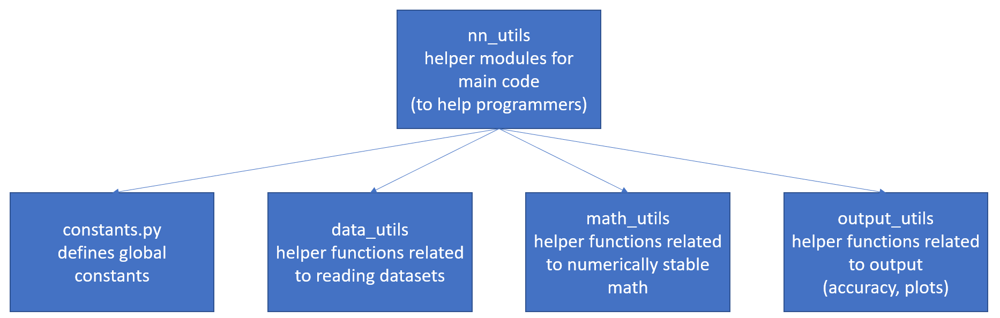

## **Guiding principles**
Ease of understanding, modularity, and ease of expanding code where three important guiding principles when I wrote the code.
As modularity is common to all three, let us understand how the neural network code is structured.

 

#### **Main structure of code**

 
 
 
 
 

#### **Structure and functionality of nn_core**

How does the nn_core code work:
- nn_loss = Add a new loss function for a specific loss in the get_loss function.
- nn_main = This defines the neural network class and will not require any edits. If required, each function's task is defined as a comment - understand and append.
- nn_optimizer = Each class is made up of an __init__ function sets up user passed variables. The setup function sets up other class variables required. The grad_update function accumulated gradients when passing through each example. The step_update function defined how the weight update has to be performed. The step_reset function resets any class variables that has to be reset after a step_update.
- nn_activations = The forward_activation function transforms pre_activation values (a(i)) of a layer to the activated values(h(i)). The grad_activation defines the derivative of h(i) wrt a(i). The grad_wrt_output defines the derivative of loss wrt to a(last_layer). 

 

#### **Structure and functionality of nn_utils**

How does the nn_utils code work:
- constants = Add a new constant by updating the __init__function.
- data_utils = This defines how the data is loaded and will not require any change for the MNIST and FashionMNIST datasets. If required, each function's task is defined as a comment - understand and append.
- math_utils = Add any specially defined mathematical utility functions here.
- output_utils = Add any functions which work on outputs - accuracy, confusion matrix, etc.

 

#### **Structure and functionality of nn_users**

How does the nn_users code work:

This should include any functionality which can be edited by the user.
- augment_data = Add a new data transformation to the list parameter of the A.compose function. You can have a look at how a particular transformation will affect your data [here](https://demo.albumentations.ai/).
- weight_init = Add a new weight initialization function which takes in three inputs - Shape of axis 0 of input, Shape of axis 1 of input and worb which can either be "w" for weights init and "b" for bias init.

 